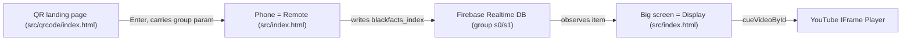

# Blackfacts Interactive Screens (`im-screens`)

An interactive, mobile-controlled display for [Blackfacts.com](https://blackfacts.com) videos
playing on an outdoor screen in Downtown Brooklyn.

A passerby scans a QR code on the big screen, which opens a control page on their phone.
From their phone they can browse the **Fact of the Day** video catalog and change what is
playing on the big screen in real time. The phone (the *remote*) and the big screen (the
*display*) stay in sync through a shared cloud database.

This repository is a fork of work by [John Henry Thompson](https://jht1493.net), remixing
[blackfacts.com](https://blackfacts.com) and powered by
[moSalon / moLib](https://github.com/molab-itp/moSalon).

---

## For the TTPR Team

Welcome! This project is maintained with the **Tech Talent Pipeline Residency Program (TTPR)**
team. It is intentionally a friendly, entry-level codebase: plain HTML, CSS, and JavaScript
with no build step, no framework, and no install. If you can open a file in an editor and
press a "Go Live" button, you can run and change this project.

Start here, in order:

1. This file - what the project is and how to run it.
2. [`src/README.md`](src/README.md) - a guided tour of the player app, file by file.
3. [`src/qrcode/README.md`](src/qrcode/README.md) - the QR-code landing page and the cloud sync.
4. [`ROADMAP.md`](ROADMAP.md) - where we want to take this next (new video series, a visual facelift).

---

## Quick start (run it locally)

There is nothing to install. You just need a local web server so the browser will load the
JavaScript files. The easiest way:

1. Open this folder in **VS Code**.
2. Install the **Live Server** extension (by Ritwick Dey) if you don't already have it.
3. Open `src/index.html` and click **"Go Live"** (or right-click the file -> *Open with Live Server*).
   - The workspace is preconfigured to use port **5505** (see [`-blackfacts.code-workspace`](-blackfacts.code-workspace)).

> Why a server and not just double-clicking the HTML? The browser blocks some features (and
> the cloud library) when a page is opened directly from the file system (`file://`). A local
> server serves the page over `http://`, which works correctly.

### Useful entry links

These are the same links from the original project. Open them once Live Server is running
(adjust the host/port to match your Live Server URL):

- [entry `?v=63`](./src/qrcode/index.html?v=63) - the QR-code landing page.
- [entry s1 `?v=63`](./src/qrcode/index.html?v=63&group=s1) - the landing page for the `s1` group.

---

## How it works (the big idea)

There is really just **one player page** (`src/index.html`). It decides at load time whether
it is acting as the big **display** or as a phone **remote**, based on the width of the screen
it is running on:

- **Wide screen (`window.innerWidth > 800`) -> Display.** Shows the YouTube video full screen.
  This is what runs on the outdoor screen.
- **Narrow screen (a phone) -> Remote.** Shows a dashboard of control buttons (Previous, Next,
  a date picker, and one button per day of the year).

When you tap a control on the phone, it does **not** talk to the big screen directly. Instead it
writes the selected video index to a shared **Firebase Realtime Database** record. The big
screen is *watching* that record, and as soon as it changes, the screen cues up the new video.

A `group` (for example `s0` or `s1`) is the shared "channel": every display and phone using the
same group sees and controls the same playback. This is how one QR code can drive one screen,
while a different group could drive a different screen.



The video catalog itself lives in [`src/dateFacts.js`](src/dateFacts.js): 365 "Fact of the Day"
entries, one per calendar day, keyed by month-and-day (`MMDD`). Each entry points at a YouTube
video.

---

## Repository map

```
im-screens/
├── README.md                 <- you are here
├── ROADMAP.md                <- future features / facelift ideas
├── -blackfacts.code-workspace
└── src/
    ├── README.md             <- guided tour of the player app
    ├── index.html            <- the player page (display OR remote)
    ├── index.js              <- app startup + wiring
    ├── player.js             <- YouTube IFrame player wrapper
    ├── init_ui.js            <- builds the remote vs. display UI
    ├── action.js             <- button / input event handlers
    ├── frame.js              <- per-frame animation loop
    ├── my_setup.js           <- local app settings
    ├── dateFacts.js          <- the 365-entry video catalog (MMDD -> video)
    ├── style.css             <- styling for the player page
    └── qrcode/
        ├── README.md         <- the landing page + cloud sync
        ├── index.html        <- the QR-code "Enter" landing page
        ├── index.js          <- landing page startup + comments UI
        ├── frame.js          <- per-frame loop for the landing page
        ├── black_my_setup.js <- app + Firebase config, group/room
        ├── black_setup_dbase.js <- database observers + comments
        └── style.css         <- styling for the landing page
```

---

## Glossary

- **Display** - the big outdoor screen. The player running in full-screen video mode (wide screen).
- **Remote** - a visitor's phone. The player running in dashboard/control mode (narrow screen).
- **Group / room** - the shared cloud channel (e.g. `s0`, `s1`) that ties a remote to a display.
  Set with the `?group=...` URL parameter. Configured in
  [`src/qrcode/black_my_setup.js`](src/qrcode/black_my_setup.js).
- **`blackfacts_index`** - the number (0-364) of the currently selected video. The remote writes
  it; the display reads it.
- **`videoKey`** - a YouTube video ID (the part after `watch?v=`).
- **`dateFacts`** - the catalog object in [`src/dateFacts.js`](src/dateFacts.js), keyed by `MMDD`.
- **moLib / moSalon** - the helper library ([`itp-molib`](https://www.npmjs.com/package/itp-molib),
  loaded from a CDN) that provides the cloud database sync (the `dbase_*` functions) and the
  `Anim` animation loop. moSalon is the broader project it comes from.
- **`?v=63`** - a cache-busting version tag added to script/links so browsers reload the latest
  files. Bump it when you change cached assets.

---

## Credits

An experimental interactive multi-screen experience by
[John Henry Thompson](https://jht1493.net), remixing
[blackfacts.com](https://blackfacts.com), powered by
[moSalon](https://github.com/molab-itp/moSalon).
