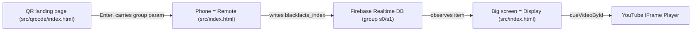
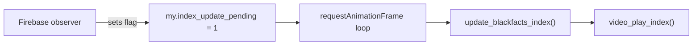
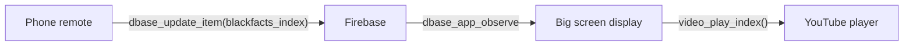

# Blackfacts Interactive Screens (`im-screens`)

An interactive, mobile-controlled display for [Blackfacts.com](https://blackfacts.com) videos
playing on an outdoor screen in Downtown Brooklyn.

A passerby scans a QR code on the big screen, which opens a control page on their phone.
From their phone they can browse the **Fact of the Day** video catalog and change what is
playing on the big screen in real time. The phone (the *remote*) and the big screen (the
*display*) stay in sync through a shared cloud database.

This repository is a fork of work by [John Henry Thompson](https://jht1493.net), remixing
[blackfacts.com](https://blackfacts.com) and powered by
[moSalon / moLib](https://github.com/molab-itp/moSalon).

It is intentionally a friendly, entry-level codebase: plain HTML, CSS, and JavaScript
with no build step, no framework, and no install. If you can open a file in an editor and
press a "Go Live" button, you can run and change this project.

---

## Quick start (run it locally)

There is nothing to install. You just need a local web server so the browser will load the
JavaScript files. The easiest way:

1. Open this folder in **VS Code**.
2. Install the **Live Server** extension (by Ritwick Dey) if you don't already have it.
3. Open `src/index.html` and click **"Go Live"** (or right-click the file → *Open with Live Server*).
   - The workspace is preconfigured to use port **5505** (see [`-blackfacts.code-workspace`](-blackfacts.code-workspace)).

> Why a server and not just double-clicking the HTML? The browser blocks some features (and
> the cloud library) when a page is opened directly from the file system (`file://`). A local
> server serves the page over `http://`, which works correctly.

### Useful entry links

Open these once Live Server is running (adjust the host/port to match your Live Server URL):

- [QR landing page `?v=63`](./src/qrcode/index.html?v=63)
- [Landing page for group s1 `?v=63`](./src/qrcode/index.html?v=63&group=s1)

---

## How it works (the big idea)

There is really just **one player page** (`src/index.html`). It decides at load time whether
it is acting as the big **display** or as a phone **remote**, based on the width of the screen
it is running on:

- **Wide screen (`window.innerWidth > 800`) → Display.** Shows the YouTube video full screen.
- **Narrow screen (a phone) → Remote.** Shows a dashboard of control buttons (Previous, Next,
  a date picker, and one button per day of the year).

When you tap a control on the phone, it does **not** talk to the big screen directly. Instead it
writes the selected video index to a shared **Firebase Realtime Database** record. The big
screen is *watching* that record, and as soon as it changes, the screen cues up the new video.



The video catalog lives in [`src/dateFacts.js`](src/dateFacts.js): 365 "Fact of the Day"
entries, one per calendar day, keyed by month-and-day (`MMDD`).

---

## Glossary

- **Display** — the big outdoor screen. The player running in full-screen video mode (wide screen).
- **Remote** — a visitor's phone. The player running in dashboard/control mode (narrow screen).
- **Group / room** — the shared cloud channel (e.g. `s0`, `s1`) that ties a remote to a display.
  Set with the `?group=...` URL parameter. Configured in
  [`src/qrcode/black_my_setup.js`](src/qrcode/black_my_setup.js).
- **`blackfacts_index`** — the number (0–364) of the currently selected video. The remote writes
  it; the display reads it.
- **`videoKey`** — a YouTube video ID (the part after `watch?v=`).
- **`dateFacts`** — the catalog object in [`src/dateFacts.js`](src/dateFacts.js), keyed by `MMDD`.
- **moLib / moSalon** — the helper library ([`itp-molib`](https://www.npmjs.com/package/itp-molib),
  loaded from a CDN) that provides the cloud database sync (the `dbase_*` functions) and the
  `Anim` animation loop.
- **`?v=63`** — a cache-busting version tag added to script/links so browsers reload the latest
  files. Bump it when you change cached assets.

---

## Repository map

```
im-screens/
├── README.md                 ← you are here
├── ROADMAP.md                ← future features / facelift ideas
├── -blackfacts.code-workspace
└── src/
    ├── README.md             ← guided tour of the player app
    ├── index.html            ← the player page (display OR remote)
    ├── index.js              ← app startup + wiring
    ├── player.js             ← YouTube IFrame player wrapper
    ├── init_ui.js            ← builds the remote vs. display UI
    ├── action.js             ← button / input event handlers
    ├── frame.js              ← per-frame animation loop
    ├── my_setup.js           ← local app settings
    ├── dateFacts.js          ← the 365-entry video catalog (MMDD → video)
    ├── style.css             ← styling for the player page
    └── qrcode/
        ├── README.md         ← the landing page + cloud sync
        ├── index.html        ← the QR-code "Enter" landing page
        ├── index.js          ← landing page startup + comments UI
        ├── frame.js          ← per-frame loop for the landing page
        ├── black_my_setup.js ← app + Firebase config, group/room
        ├── black_setup_dbase.js ← database observers + comments
        └── style.css         ← styling for the landing page
```

**Start reading in this order:**

1. This file — project overview and the JavaScript techniques guide (below)
2. [`src/README.md`](src/README.md) — a guided tour of the player app, file by file
3. [`src/qrcode/README.md`](src/qrcode/README.md) — the QR-code landing page and cloud sync
4. [`ROADMAP.md`](ROADMAP.md) — where we want to take this next

---

# Vanilla JavaScript Techniques for Students

This codebase is intentionally **plain HTML, CSS, and JavaScript** — no React, no npm build, no ES modules. Students who recognize these patterns will be able to read, debug, and extend the project confidently.

Throughout this guide, each section includes two extra lenses beyond the concept and codebase usage:

- **In the wider world** — where you will see this pattern outside this repo
- **Watch out for** — common pitfalls and things to pay attention to

Code examples below are taken from this repo and include **verbose comments** explaining each step. When you see `...` in a block, the full version lives in the cited file.

---

## 1. Script-Tag Architecture (No Modules)

**The concept:** In many JavaScript projects, files use `import` and `export` to share code in isolated "modules." This project takes a simpler approach: each `.js` file is loaded with a `<script src="...">` tag, and everything it defines becomes available in the **global scope** — the shared namespace that all scripts on the page can see.

The app loads JS files sequentially via `<script src="...">` in [src/index.html](src/index.html). Each file adds functions and variables to that shared global scope.

**What to learn:**

- How script load order matters (later files can call functions defined in earlier files)
- Why there is no `import` / `export` — everything is a global
- Cache busting with `?v=63` query strings on script/CSS URLs (forces the browser to reload updated files instead of using a cached copy)

**Example — startup sequence** ([src/index.js](src/index.js)):

```javascript
// Wait until the HTML is fully parsed before running any setup code.
// Without this, scripts in <head> might run before buttons and divs exist.
document.addEventListener('DOMContentLoaded', document_loaded);

function document_loaded() {
  my_setup();           // Fill the `my` object with local settings (timing, isRemote, etc.)
  init_ui();            // Build the phone dashboard OR hide it for display mode
  black_setup_dbase();  // Connect to Firebase and start listening for changes
  setTimeout(update_blackfacts_num_ui, 1000);  // Refresh caption text after 1 second

  // moLib's Anim timer — steps a counter on each animation frame
  my.animLoop = new Anim({ target: my, time: my.animTime });

  // On the phone only: periodically report device status to the cloud
  if (my.isRemote) {
    my.pingLoop = new Anim({ target: my, time: my.pingTime, action: pingAction });
  }

  setup_animationFrame();  // Start the main per-frame loop in frame.js
}
```

**Key globals to know:**

| Global | Defined in | Purpose |
|--------|-----------|---------|
| `my` | [src/index.js](src/index.js) | Central state bag |
| `dateFacts` | [src/dateFacts.js](src/dateFacts.js) | 365-entry video catalog |
| `dateFactsKeys`, `nfacts` | [src/player.js](src/player.js) | Sorted catalog keys |
| `params` | [src/player.js](src/player.js) | URL query params (Proxy) |
| `player` | [src/player.js](src/player.js) | YouTube player instance |

**Naming convention:** files describe their role — `action.js` = events, `frame.js` = animation loop, `init_ui.js` = DOM construction, `*_setup.js` = initialization.

**In the wider world:** Script tags without a bundler still appear in legacy enterprise apps, WordPress themes, embedded widgets (chat widgets, analytics snippets), and small marketing landing pages. Google Analytics, Stripe checkout, and many ad trackers inject `<script>` tags that rely on globals like `gtag` or `Stripe`. Even in modern apps, third-party SDKs often still load this way.

**Watch out for:**

- **Load order bugs** — if `action.js` loads before `index.js` defines a function it needs, you get `ReferenceError: ... is not defined`. Always check the `<script>` order in `index.html`.
- **Global name collisions** — any script can overwrite `my`, `player`, or any other global. A typo like `my = null` in the wrong place can break the whole app silently.
- **Cache busting** — if you change a JS file but forget to bump `?v=63`, your browser may show old behavior. Hard-refresh (Ctrl+Shift+R) helps during development.
- **Every file loads entirely** — there is no bundler to drop unused code. A 2900-line `dateFacts.js` loads even if you only need one entry.

---

## 2. DOM Access and Manipulation

**The concept:** When a browser loads an HTML page, it builds an in-memory tree of every element on the page — headings, buttons, divs, inputs, and so on. This tree is called the **Document Object Model (DOM)**. JavaScript can read and change that tree: update text, show or hide elements, create new buttons, and attach behavior to them. Most of what this app does visually happens through DOM manipulation.

### Named element globals (HTML `id` → JS variable)

Elements with `id` attributes are accessed **by name directly** — no `getElementById`. This works because the browser automatically creates a global variable for each element that has an `id`.

**Example — wiring up controls** ([src/action.js](src/action.js)):

```javascript
// `id_dashboard`, `id_button_next`, etc. are NOT declared in this file.
// They are the actual HTML elements from index.html — the browser exposes
// any element with an id="..." attribute as a global variable by that name.

// When the user clicks anywhere on the dashboard panel, run dashboard_action
id_dashboard.addEventListener('click', dashboard_action);

// Playback controls — each button gets its own handler function
id_button_next.addEventListener('click', next_action);
id_button_previous.addEventListener('click', previous_action);
id_button_youtube.addEventListener('click', youtube_action);

// The date picker fires 'input' every time the user picks a new date
// The third argument `false` means "don't use capture phase" (the default)
id_date.addEventListener('input', date_input_action, false);

id_button_toggle_buttons.addEventListener('click', toggle_buttons_action);
```

**How this codebase uses the DOM:**

- `element.innerHTML` — set text or HTML content ([src/index.js](src/index.js))
- `element.classList.add/remove/toggle/contains('hidden')` — show/hide via a CSS class ([src/init_ui.js](src/init_ui.js), [src/style.css](src/style.css))
- `element.style.left = value + 'px'` — inline positioning ([src/init_ui.js](src/init_ui.js))
- `element.value` — read/write form inputs like the date picker ([src/action.js](src/action.js))

### Dynamic element creation

Instead of writing 365 buttons in HTML, the app generates them in a loop.

**Example — building the day-button grid** ([src/init_ui.js](src/init_ui.js)):

```javascript
function create_index_buttons() {
  // The container div where all 365 buttons will live (defined in index.html)
  let button_host = id_index_button_container;

  // Loop from 0 to 364 — one button per video in the catalog
  for (let index = 0; index < nfacts; index++) {
    // Build a label like "#001 0101" — pad the number to 3 digits
    let label1 = '#' + ('' + (index + 1)).padStart(3, '0');
    let label = label1 + ' ' + dateFactsKeys[index];

    // Create a brand-new <button> element in memory (not yet on the page)
    const elt = document.createElement('button');
    elt.innerHTML = label;           // Set the visible text inside the button
    button_host.appendChild(elt);    // Attach it to the container — now it appears on screen

    // Each button needs its own click handler that knows WHICH day was clicked.
    // The inner `function` is a closure — it captures the current `index`
    // from this loop iteration and keeps it even after the loop moves on.
    elt.addEventListener('click', function () {
      toggle_365_panes();                    // Hide the button grid after selection
      update_blackfacts_index_dbase(index);  // Tell Firebase to play this video
    });
  }

  toggle_365_panes();  // Start with the grid hidden
}
```

### Dynamic script injection

**Example — loading the YouTube API** ([src/player.js](src/player.js)):

```javascript
// YouTube doesn't ship with the page — we have to fetch their script at runtime.
// Create a new <script> element pointing at YouTube's iframe API
var tag = document.createElement('script');
tag.src = 'https://www.youtube.com/iframe_api';

// Find the first <script> tag already on the page
var firstScriptTag = document.getElementsByTagName('script')[0];

// Insert our new script BEFORE that one — this starts downloading the API.
// When it finishes loading, YouTube calls our global onYouTubeIframeAPIReady().
firstScriptTag.parentNode.insertBefore(tag, firstScriptTag);
```

**In the wider world:** Every interactive website uses the DOM — toggling navigation menus, updating shopping cart counts, infinite scroll lists, form validation messages, and modal dialogs. jQuery (`$('#btn').click(...)`) was the dominant DOM library for years and is still common in older codebases. Browser DevTools "Elements" tab shows the live DOM tree.

**Watch out for:**

- **`innerHTML` and security** — inserting user-provided text via `innerHTML` can open XSS vulnerabilities. This app builds comment HTML from Firebase data; be careful if you extend that feature.
- **Stale references** — if you remove and recreate DOM nodes, old variable references point to detached elements that are no longer on the page.
- **Manual sync required** — when `my.blackfacts_index` changes, some function must also update the DOM (e.g. `update_blackfacts_num_ui()`). Forgetting that call means the screen shows stale text.
- **The `id`-as-global trick is fragile** — duplicate `id` values break HTML validity; renamed IDs break JS silently with no error until something doesn't work.

---

## 3. Event Handling

**The concept:** Browsers are interactive — they constantly report things that happen: a button was clicked, the page finished loading, the window was resized, a date picker value changed. These notifications are called **events**. JavaScript can **listen** for specific events and run a function (a **handler** or **callback**) when they occur. This is how user actions connect to app logic.

### Top-level listener registration

Handlers in [src/action.js](src/action.js) are attached when the script **parses** — not inside `DOMContentLoaded`. This works because HTML elements with `id` exist before scripts at the bottom of `<body>` run.

**Example — what happens when the user taps "Next"** ([src/action.js](src/action.js)):

```javascript
function next_action() {
  // Read the current video index from shared state (0–364)
  // Add 1 to go forward, then use modulo (%) to wrap back to 0 after the last video
  let index = (my.blackfacts_index + 1) % nfacts;

  // Write the new index to Firebase — the big screen will pick this up via its observer
  update_blackfacts_index_dbase(index);
}
```

**Example — reading the date picker** ([src/action.js](src/action.js)):

```javascript
function date_input_action() {
  // id_date.value looks like "2025-01-15" (YYYY-MM-DD format from the HTML date input)
  // Skip the year and dash: substring(5) gives "01-15"
  let mmdd = id_date.value.substring(5);

  // Remove the dash between month and day: "01" + "15" = "0115"
  let key = mmdd.substring(0, 2) + mmdd.substring(3, 5);

  // Look up that day in the catalog object — keys are MMDD strings like "0115"
  let ent = dateFacts[key];
  if (!ent) {
    console.log('date_input_action missing key', key, ent);
    return;  // No video for this date — stop here
  }

  // Each catalog entry stores its position in the sorted list (0–364)
  let index = ent.index;
  update_blackfacts_index_dbase(index);  // Tell Firebase to play this video
}
```

### Handler naming convention

All handlers end in `_action`: `next_action`, `date_input_action`, `toggle_buttons_action`. Setup functions end in `_setup`; update functions start with `update_`.

### Third-party callback hooks

Some libraries don't use `addEventListener` — they call **your** functions by name when something happens.

**Example — YouTube API ready callback** ([src/player.js](src/player.js)):

```javascript
// YouTube's script looks for a GLOBAL function with this exact name.
// When their API finishes loading, they call it automatically.
function onYouTubeIframeAPIReady() {
  // Guard: only create the player once, even if this callback fires twice
  if (!player) {
    setupVideo();  // Creates new YT.Player(...) and wires up onReady, onStateChange, etc.
  }
}
```

### Lifecycle events

- `DOMContentLoaded` — fires when the HTML is parsed and ready; used for startup in [src/index.js](src/index.js)
- `resize` — fires when the window size changes; used on the landing page ([src/qrcode/index.js](src/qrcode/index.js))

**In the wider world:** Events are universal — mobile apps have tap/gesture handlers, desktop apps have click/keyboard handlers, game engines have frame/update loops triggered by events. On the web: form submissions, keyboard shortcuts (Ctrl+S), drag-and-drop file uploads, and scroll-based animations all use the same event-listener model. Node.js servers use a similar pattern (`server.on('request', handler)`).

**Watch out for:**

- **When listeners attach** — this app attaches at script parse time, which only works because scripts are at the bottom of `<body>`. Putting scripts in `<head>` without `DOMContentLoaded` would fail because the elements don't exist yet.
- **Forgetting to remove listeners** — can cause memory leaks in single-page apps. This app reloads the full page often, so leaks are less critical here.
- **Multiple listeners on the same element** — calling `addEventListener` twice on the same element with the same handler adds two handlers; the function runs twice per click.
- **Global callback names** — `onYouTubeIframeAPIReady` must exist on `window` with exactly that name. Renaming it breaks YouTube integration with no clear error message.

---

## 4. The `my` Object — Manual State Management

**The concept:** An app's **state** is the current data it needs to remember: which video is playing, whether this device is a phone or a big screen, whether a database update is waiting to be applied. This project uses a single plain JavaScript object named `my` that any script can read from or write to — there is no framework automatically syncing state to the screen.

**Example — declaring and filling the state object:**

```javascript
// Created empty in index.js (and separately in qrcode/index.js for the landing page)
let my = {};

// my_setup.js adds timing values, initial index, and the phone-vs-display decision
my.animTime = 1000;
my.blackfacts_index = -1;
my.isRemote = !my.showQRCode();  // true on a phone, false on the big screen

// black_my_setup.js adds cloud config and helper methods
my.mo_group = 's0';  // Which Firebase "channel" this device belongs to
my.showQRCode = function () {
  // Wide screen (> 800px) = display mode; narrow = remote (phone) mode
  return window.innerWidth > 800;
};
```

**Key properties students will touch:**

| Property | Meaning |
|----------|---------|
| `my.blackfacts_index` | Current video (0–364) |
| `my.isRemote` | Phone vs display mode |
| `my.index_update_pending` | DB change waiting for frame loop |
| `my.mo_group` | Cloud sync channel (`s0`, `s1`) |
| `my.comment_store` | Comments keyed by Firebase key |

When you see `my.something = ...` anywhere in the code, ask: **"What is this storing, and who reads it later?"**

**In the wider world:** Manual state bags appear in game engines (`game.player.health`), Arduino firmware (global struct), and older jQuery apps (`App.state.currentUser`). Tools like Redux and Zustand evolved to solve the problems this pattern creates at scale — mainly "who changed what?" and "why didn't the screen update?"

**Watch out for:**

- **No automatic UI updates** — changing `my.blackfacts_index` does not update the screen unless some function reads it and updates the DOM. Trace both the write *and* the read path.
- **Hidden mutations** — any file can change `my` at any time. When debugging, search the whole codebase for `my.blackfacts_index` to find every place it is read or written.
- **No single source of truth enforcement** — `my.blackfacts_index` could disagree with what's in Firebase if a write fails silently.
- **Initialization order** — properties added to `my` in different setup files depend on script load order. Missing a setup call means `undefined` at runtime.

---

## 5. Pending-Flag + requestAnimationFrame Pattern

**The concept:** `requestAnimationFrame` is a browser API that asks the browser to call your function right before the next screen repaint — typically about 60 times per second. Game developers use it as a **game loop**; this app uses it as a steady heartbeat that checks for work to do each frame.

This is one of the most important **architectural patterns** in the codebase. Firebase callbacks do **not** update the player directly — they set a flag on `my`, and the animation frame loop applies it on the next frame. This avoids race conditions between asynchronous database updates and the YouTube player.



**Example — the main frame loop** ([src/frame.js](src/frame.js)):

```javascript
function setup_animationFrame() {
  // Kick off the loop — the browser will call animationFrame_callback before each repaint
  window.requestAnimationFrame(animationFrame_callback);
}

function animationFrame_callback(timeStamp) {
  // FIRST: schedule the next frame immediately — this keeps the loop running forever
  window.requestAnimationFrame(animationFrame_callback);

  // timeStamp is milliseconds since the page loaded; convert to seconds for comparisons
  let timeSecs = timeStamp / 1000;

  // --- Pending index update from Firebase ---
  // The observer set my.index_update_pending = 1; we apply it here, not in the callback
  if (my.index_update_pending) {
    my.index_update_pending = 0;  // Clear the flag BEFORE doing the work (avoid re-entry)
    update_blackfacts_index(my.blackfacts_index);  // Update caption + cue the video
  }

  // --- Autoplay workaround ---
  // YouTube sometimes ignores playVideo() if called at the wrong moment.
  // If we cued a video but it isn't playing yet, try playVideo() on the next frame.
  if (
    my.video_index_cued != null &&
    player_ready() &&
    player.getPlayerState() != YT.PlayerState.PLAYING
  ) {
    my.video_index_was_played = my.video_index_cued;
    my.video_index_cued = null;
    player.playVideo();
  }

  // --- Player not ready yet? ---
  // If a play was requested before YouTube finished initializing, hold it here
  if (my.video_play_index_pending != null && player_ready()) {
    let index = my.video_play_index_pending;
    my.video_play_index_pending = null;
    video_play_index(index);
    return;
  }

  // --- Stall detection ---
  // If the YouTube player hasn't initialized after 5 seconds, reload the page
  if (!my.blackfacts_player_inited && timeSecs > 5.0) {
    player_startup_stalled();
  }

  // Step the moLib animation timers (clip advance, status ping)
  if (my.animLoop) my.animLoop.step({ action: stepAction, loop: my.playClip });
  if (my.pingLoop) my.pingLoop.step({ loop: 1 });

  show_message_status(timeSecs);  // Update the "Waiting for video..." caption
}
```

**In the wider world:** `requestAnimationFrame` powers browser games (Phaser, Three.js), scroll-driven animations, canvas drawing, and performance monitoring dashboards. The "defer work to next frame" pattern appears anywhere async callbacks might conflict with rendering — video editors, map libraries, and charting tools use similar queues.

**Watch out for:**

- **Why defer at all?** — YouTube's player API is finicky if you call `cueVideoById` from inside a Firebase callback. The frame loop serializes updates. If you bypass the flag and call `video_play_index()` directly from an observer, you may hit hard-to-reproduce bugs.
- **Infinite loop cost** — `animationFrame_callback` runs ~60 times per second forever. Keep work inside it light. Heavy logic every frame drains battery on phones.
- **Flag never cleared** — if you set `my.index_update_pending = 1` but the frame loop never runs (JS error earlier in callback), updates stall. Check the console.
- **Multiple pending flags** — this app uses several (`index_update_pending`, `video_play_index_pending`, `comment_update_pending`). Understand which flag gates which behavior before adding a new one.

---

## 6. Async Patterns (Callbacks, Not fetch)

**The concept:** Some operations take time — connecting to a database, loading a video, waiting a few seconds before advancing. JavaScript is **single-threaded**, meaning it can't pause and wait without freezing the page. Instead, you register a **callback** function that runs later when the operation completes. **Promises** and **async/await** are newer ways to organize this; this codebase uses mostly callbacks, with a small amount of async/await.

There is **no `fetch`** in this app. Network I/O goes through **moLib → Firebase** (a cloud database), not direct HTTP requests written in this project's code.

**Example — connecting to Firebase with async/await** ([src/qrcode/black_setup_dbase.js](src/qrcode/black_setup_dbase.js)):

```javascript
async function black_setup_dbase() {
  my.comment_count = 0;

  // `await` pauses THIS function until Firebase is connected and ready.
  // The rest of the page keeps running — buttons still work, animations continue.
  await dbase_app_init(my);

  // Only after the connection succeeds do we start listening for changes
  observe_meta();           // Watch for video index changes from the phone
  observe_comment_store();  // Watch for new/edited/deleted comments
}
```

**Example — Firebase observer (callback pattern)** ([src/qrcode/black_setup_dbase.js](src/qrcode/black_setup_dbase.js)):

```javascript
function observe_meta() {
  // Tell moLib: "whenever the 'item' record in Firebase changes, call observed_item"
  dbase_app_observe({ observed_item }, 'item');

  // This function runs every time Firebase pushes an update — could be often!
  function observed_item(item) {
    // item is the latest data from the cloud, e.g. { blackfacts_index: 42 }

    if (item.blackfacts_index != undefined) {
      my.blackfacts_index = item.blackfacts_index;  // Store the new index locally
    }

    // Don't update the player here — just set a flag for the frame loop to handle
    my.index_update_pending = 1;
  }
}
```

**Example — delayed actions with setTimeout:**

```javascript
// index.js — wait 1 second after startup before refreshing the caption text
setTimeout(update_blackfacts_num_ui, 1000);

// frame.js — if the player stalls, reload the page after 5 seconds
setTimeout(function () {
  window.location.reload();
}, 5.0 * 1000);

// action.js — after a video ends, wait my.echo_delay seconds before auto-advancing
window.setTimeout(() => next_action(), my.echo_delay * 1000);
```

**In the wider world:** Callbacks powered early Node.js (`fs.readFile(path, callback)`). Promises and async/await are now standard for REST APIs. Real-time apps (Slack, Figma, Google Docs) use WebSocket or Firebase-style observers — push updates to you rather than you polling. `setTimeout` appears everywhere: debounced search inputs, toast notifications that auto-dismiss, and "retry after 3 seconds" error recovery.

**Watch out for:**

- **Callback timing** — Firebase observers can fire immediately on subscribe *and* on every change. Don't assume one call = one user action.
- **Race conditions** — if two remotes change the video at once, last write wins. No conflict resolution in this app.
- **async without await** — calling an `async` function without `await` or `.catch()` swallows errors. Always handle rejections.
- **setTimeout and page unload** — a pending reload timeout in [src/frame.js](src/frame.js) will still fire unless cleared with `clearTimeout`.
- **No loading/error UI** — this app mostly logs errors to console. If you add features, consider showing the user when something fails.

---

## 7. Data Structures and Lookup Patterns

**The concept:** JavaScript objects and arrays are the primary ways to organize data. This app stores its entire video catalog as a **lookup object** (key → value) and uses simple algorithms to navigate it.

**Example — the catalog structure** ([src/dateFacts.js](src/dateFacts.js)):

```javascript
// Keys are MMDD strings — month and day with zero-padding
const dateFacts = {
  '0101': {
    videoKey: 'VZTSYcFTNSA',       // YouTube video ID (the part after watch?v=)
    title: 'BlackFacts Minute: January 1',
    description: 'Fact-Of-The-Day for: January 01 ...',
    thumbnail: 'https://i.ytimg.com/vi/VZTSYcFTNSA/maxresdefault.jpg',
    index: 0,                       // Position in the sorted list (0 = first video)
  },
  '0102': { /* ... */ },
  // ... 365 entries total
};
```

**Example — building a sorted index and looking up by position** ([src/player.js](src/player.js)):

```javascript
// Get all MMDD keys and sort them alphabetically → ['0101', '0102', ..., '1231']
let dateFactsKeys = Object.keys(dateFacts).sort();
let nfacts = dateFactsKeys.length;  // 365

function dateFactForIndex(index) {
  // Step 1: index 0 → key '0101', index 1 → key '0102', etc.
  let key = dateFactsKeys[index];
  // Step 2: key '0101' → the full entry object with videoKey, title, etc.
  return dateFacts[key];
}
```

**Example — circular next/previous navigation** ([src/action.js](src/action.js)):

```javascript
// NEXT: add 1, then modulo wraps 364 → 0 (back to first video)
let index = (my.blackfacts_index + 1) % nfacts;

// PREVIOUS: subtract 1, but add nfacts first so we never go negative
// e.g. at index 0: (0 - 1 + 365) % 365 = 364 (wrap to last video)
let index = (my.blackfacts_index - 1 + nfacts) % nfacts;
```

**Example — reading URL parameters with a Proxy** ([src/player.js](src/player.js)):

```javascript
// window.location.search is like "?group=s0&playlist=today"
// URLSearchParams knows how to parse that into key/value pairs
let params = new Proxy(new URLSearchParams(window.location.search), {
  // Intercept every property read — params.group becomes searchParams.get('group')
  get: (searchParams, prop) => searchParams.get(prop),
});

// Now we can write params.playlist instead of params.get('playlist')
let playlist = (params.playlist || 'today').split(',');
let delay = params.delay || 0;
```

**In the wider world:** Lookup objects (dictionaries/hash maps) are fundamental in every language — user profiles keyed by ID, product catalogs keyed by SKU, config keyed by environment name. Modulo wrapping appears in carousel components, playlist repeat modes, and circular buffers. `URLSearchParams` is used in any app that reads `?tab=settings` or UTM tracking params.

**Watch out for:**

- **Key type consistency** — `dateFacts` keys are strings (`'0101'`), not numbers (`101`). `dateFacts[101]` returns `undefined`. Always check key format.
- **Missing keys** — `date_input_action` checks `if (!ent) return;` before using a lookup result. Always guard against undefined.
- **`for...in` and inherited properties** — iterating `my.comment_store` is safe for plain objects, but `for...in` on prototypes can surprise you. `Object.keys()` is safer in modern code.
- **Large static files** — `dateFacts.js` is ~2900 lines. Editing it by hand is error-prone.
- **Proxy gotchas** — `params.playlist` returns `null` (not `undefined`) when missing. Falsy checks behave differently than with plain objects.

---

## 8. Functional Style (No Classes)

**The concept:** JavaScript supports multiple styles of organizing code. **Object-oriented** code uses `class` to define types with methods and inheritance. **Functional** code uses plain functions that take inputs and produce outputs, without classes. This entire codebase is functional — no `class` keyword anywhere.

**Example — the patterns you will see throughout the repo:**

```javascript
// 1. Top-level named function — hoisted, callable from any other file
function next_action() { /* ... */ }

// 2. Arrow function — common for short callbacks passed to setTimeout or Proxy
window.setTimeout(() => execCommand(), delay);

// 3. Nested named function — only visible inside its parent function
function observe_meta() {
  dbase_app_observe({ observed_item }, 'item');
  function observed_item(item) { /* ... */ }  // Can't be called from outside observe_meta
}

// 4. Rest parameters — collect any number of arguments into an array
function ui_log(...args) {
  console.log(...args);  // Spread them back out to console.log
}

// 5. Attaching a method to the shared state object (not a class — just a function on an object)
my.showQRCode = function () {
  return window.innerWidth > 800;
};
```

External libraries use constructor-style calls, but the project itself does not:

- `new YT.Player('id_player', { ... })` — YouTube
- `new Anim({ target: my, time: my.animTime })` — moLib timer

**In the wider world:** Functional JS dominates modern front-end — utility functions, pure functions, and composition over inheritance. Node.js middleware (`(req, res, next) => ...`), array methods (`.map`, `.filter`, `.reduce`), and serverless handlers are all functional. Classes still appear in Java, C#, and game engines where inheritance hierarchies are natural.

**Watch out for:**

- **Function hoisting** — `function foo() {}` is hoisted (callable before its line). `const foo = () => {}` is not. This codebase uses both styles; order matters for `const`/`let`.
- **Global function namespace** — 50+ top-level functions across files with no namespace prefix. Name collisions are possible if two files define the same function name.
- **Testing** — pure functions with no globals are easy to unit test. Functions that read `my` or `id_date` are harder to test in isolation.

---

## 9. Browser APIs

**The concept:** JavaScript running in a browser can do more than manipulate variables and call functions — it can talk to the **browser itself** through built-in objects and methods. These are called **Browser APIs** (sometimes **Web APIs**). They are not part of the JavaScript language itself; they are services the browser provides to JavaScript code.

Think of it this way: the JavaScript **language** gives you `if`, `for`, `function`, objects, and arrays. The **browser** gives you `document` (the DOM), `window` (the browser window), `setTimeout`, fullscreen, dialogs, and much more. You access them through global objects like `window`, `document`, and `console`.

This project uses a focused subset of browser APIs. Here is what it does use, grouped by purpose:

### Window and screen

| API | What it is | How this codebase uses it |
|-----|-----------|--------------------------|
| `window.innerWidth` | The width of the browser viewport in pixels | Decides display vs remote mode: `> 800` means big screen ([src/qrcode/black_my_setup.js](src/qrcode/black_my_setup.js)) |
| `window.open(href, '_blank')` | Opens a URL in a new browser tab | Opens the current YouTube video on youtube.com ([src/action.js](src/action.js)) |
| `window.location` / `.reload()` | The current page URL; reload restarts the page | Stall recovery reloads if the player never starts ([src/frame.js](src/frame.js)) |

### URL and navigation

| API | What it is | How this codebase uses it |
|-----|-----------|--------------------------|
| `URLSearchParams` | Parses the `?key=value&...` part of a URL | Reads `group`, `playlist`, `delay`, and other config from the URL ([src/player.js](src/player.js)) |
| `window.location.search` | The raw query string | Wrapped in a Proxy for convenient property access |
| `location.origin` | The protocol + host (e.g. `http://localhost:5505`) | Building links on the landing page |

### Timing

| API | What it is | How this codebase uses it |
|-----|-----------|--------------------------|
| `setTimeout(fn, ms)` | Run a function once after a delay | Deferred UI updates, stall recovery reload, echo delay ([src/index.js](src/index.js), [src/frame.js](src/frame.js), [src/action.js](src/action.js)) |
| `requestAnimationFrame(fn)` | Run a function before the next screen repaint (~60fps) | The main game loop in [src/frame.js](src/frame.js) |

### Fullscreen

| API | What it is | How this codebase uses it |
|-----|-----------|--------------------------|
| `document.fullscreenElement` | Returns the element currently in fullscreen, or null | Check whether fullscreen is active ([src/action.js](src/action.js)) |
| `element.requestFullscreen()` / `document.exitFullscreen()` | Enter or leave fullscreen mode | Toggle fullscreen on the display |

### User dialogs

| API | What it is | How this codebase uses it |
|-----|-----------|--------------------------|
| `confirm(message)` | Shows a yes/no dialog; returns true or false | "Are you sure?" before deleting a comment ([src/qrcode/black_setup_dbase.js](src/qrcode/black_setup_dbase.js)) |
| `alert(message)` | Shows an informational popup | Error display via `ui_error()` helper |

### Date and time

| API | What it is | How this codebase uses it |
|-----|-----------|--------------------------|
| `new Date()` | Creates a date/time object for right now | Timestamps on comments ([src/qrcode/black_setup_dbase.js](src/qrcode/black_setup_dbase.js)) |
| `.toISOString()` | Formats a date as `"2025-06-02T14:30:00.000Z"` | Storing a standardized timestamp string |

### Debugging

| API | What it is | How this codebase uses it |
|-----|-----------|--------------------------|
| `console.log(...)` | Prints values to the browser's developer console | Used throughout every JS file for debugging |

Open the console with F12 (or right-click → Inspect → Console) to see these messages while the app runs.

### File download (dev utility)

| API | What it is | How this codebase uses it |
|-----|-----------|--------------------------|
| `encodeURIComponent(text)` | Escapes special characters for use in a URL | Building a data URL for file content |
| Data URLs (`data:text/plain,...`) | A URL that embeds file content directly | [src/player.js](src/player.js) creates a temporary `<a>` element to download the catalog as a text file |

### Third-party browser APIs (loaded externally)

| API | What it is | How this codebase uses it |
|-----|-----------|--------------------------|
| YouTube IFrame Player API | YouTube's SDK for embedding and controlling videos | Loaded dynamically in [src/player.js](src/player.js); provides `YT.Player`, `YT.PlayerState`, etc. |
| moLib (`itp-molib`) | A helper library for Firebase sync and animation timers | Loaded from CDN in [src/index.html](src/index.html); provides `dbase_*` functions and `Anim` |

**In the wider world:** Browser APIs are how every web app interacts with the platform — Gmail uses the Clipboard API, Google Maps uses Geolocation, Spotify uses the Media Session API, PWAs use Service Workers for offline support. MDN Web Docs (developer.mozilla.org) is the reference for all Web APIs. Node.js has a *different* API surface (`fs`, `http`, `process`) — code written for the browser often doesn't run in Node without adaptation.

**Watch out for:**

- **Browser compatibility** — `requestFullscreen()` needs vendor prefixes on older browsers (`webkitRequestFullscreen`). This kiosk likely runs on a known browser; public apps must test more broadly.
- **`window.open` blocked by pop-up blockers** — user-initiated clicks usually work; programmatic opens may not.
- **`confirm`/`alert` block the main thread** — the page freezes until the user clicks OK. Fine for a simple kiosk; awkward for polished apps.
- **APIs only work in secure contexts** — some APIs (camera, geolocation, service workers) require HTTPS. Localhost is treated as secure; `file://` is not — another reason this project needs Live Server.
- **Third-party API load timing** — YouTube's `onYouTubeIframeAPIReady` may fire before or after your code runs. This app guards with `if (!player)`. Race conditions with external SDKs are common.
- **Don't assume Node.js APIs work in the browser** — `fs.readFile`, `require()`, and `process.env` are Node-only.

**APIs this codebase deliberately does not use:** `fetch`, `localStorage`, `sessionStorage`, `querySelector`, Shadow DOM, Service Workers.

---

## 10. Display ↔ Remote Sync Architecture

Understanding the data flow is essential for any feature work:



**Example — the write path (phone)** ([src/index.js](src/index.js)):

```javascript
// Called when the user taps Next, Previous, a day button, or the date picker
function update_blackfacts_index_dbase(index) {
  // Write the chosen index to Firebase under the shared 'item' record.
  // Every device watching this group will receive the update.
  dbase_update_item({ blackfacts_index: index }, 'item');
}
```

**Example — the read path (big screen)** — spans three files:

```javascript
// black_setup_dbase.js — Firebase pushes the new index to us
function observed_item(item) {
  if (item.blackfacts_index != undefined) {
    my.blackfacts_index = item.blackfacts_index;  // Store locally
  }
  my.index_update_pending = 1;  // Tell the frame loop to act on it
}

// frame.js — next animation frame picks up the flag
if (my.index_update_pending) {
  my.index_update_pending = 0;
  update_blackfacts_index(my.blackfacts_index);
}

// index.js — update caption and tell the YouTube player
function update_blackfacts_index(newValue) {
  my.blackfacts_index = newValue;
  update_blackfacts_num_ui();   // Refresh the on-screen caption text
  video_play_index(newValue);   // Look up videoKey and cue the video
}
```

Mode is decided once at startup (`my.isRemote = !my.showQRCode()`), not reactively on resize.

**In the wider world:** This is a **pub/sub** (publish/subscribe) pattern — one device publishes state, others subscribe. Similar architectures power Spotify Connect (phone controls speaker), Chromecast (phone controls TV), collaborative whiteboards (Figma), live sports scoreboards, and IoT smart home hubs. The cloud database is the message bus.

**Watch out for:**

- **Same group required** — remote and display must share the same `?group=s0` (or whatever). Mismatched groups means they never sync. Check the URL on both devices.
- **Mode is set once** — resizing a desktop browser from wide to narrow mid-session does not switch modes.
- **Write vs read paths are separate functions** — students often debug the wrong side. "Video didn't change on the display" → check the observer and frame loop. "Button on phone did nothing" → check `next_action` and `dbase_update_item`.
- **Offline / latency** — Firebase sync depends on network. Slow connections mean delayed video changes. No offline queue in this app.
- **Security** — Firebase rules (not in this repo) control who can write. Open rules mean anyone with the group name can hijack the screen.

---

## 11. Suggested Learning Path for Students

**Week 1 — Read and trace:**

1. Open [src/index.html](src/index.html) and find every `id_*` element
2. Follow `next_action()` from button click → DB write → observer → frame loop → video cue
3. Resize browser below/above 800px to see remote vs display UI ([src/init_ui.js](src/init_ui.js))
4. For each concept section above, find one example of it in the codebase and add a comment explaining what each line does

**Week 2 — Small changes:**

1. Change button labels or CSS in [src/style.css](src/style.css)
2. Add a `console.log` in `animationFrame_callback` to watch pending flags
3. Parse a new URL parameter using the `params` Proxy pattern

**Week 3 — Feature-sized work:**

1. Add a new control button (HTML + `action.js` handler + DB write)
2. Add an entry to `dateFacts` or understand the catalog structure
3. Work on the QR landing page comments flow in [src/qrcode/](src/qrcode/)

---

## What Students Will NOT Find Here

- React, Vue, or any component framework
- npm, Webpack, Vite, or a build step
- ES module `import` / `export`
- `class` syntax or inheritance
- `fetch` or REST API calls
- Unit tests

These absences are **intentional** — this repo is a friendly entry point to classic browser JS. Everything you learn here — the DOM, events, state, async callbacks, and browser APIs — is the foundation that all web development builds on.

---

## Credits

An experimental interactive multi-screen experience by
[John Henry Thompson](https://jht1493.net), remixing
[blackfacts.com](https://blackfacts.com), powered by
[moSalon](https://github.com/molab-itp/moSalon).
