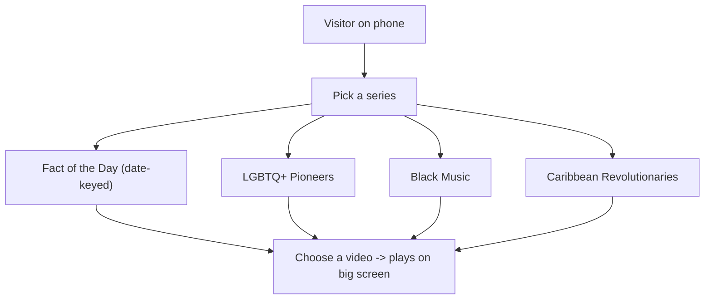

# Roadmap & Ideas

This document captures where we'd like to take the Blackfacts interactive display. It is
**discussion material** for the TTPR Team and for the brainstorm with John Henry Thompson - it
describes a direction, not finished decisions. **None of this is implemented yet.** When we
build a piece of it, that work should happen on its own feature branch off `develop`.

For how the project works today, see the [root README](README.md), [`src/README.md`](src/README.md),
and [`src/qrcode/README.md`](src/qrcode/README.md).

---

## Where we are today

- One video catalog: **Fact of the Day** (365 entries, one per calendar day) in
  [`src/dateFacts.js`](src/dateFacts.js).
- A functional but **utilitarian** look: black background, white monospace text, plain buttons
  (see [`src/style.css`](src/style.css)).
- A phone remote drives the big screen in real time via a shared cloud `group`.

---

## Theme 1 - A visual facelift (June / Pride)

The interface works, but it looks like a developer tool. We want a warm, modern, on-brand
experience that feels good on the street and on a phone.

Ideas to discuss:

- Replace the monospace/black-and-white styling with a designed look: typography, color, spacing,
  and friendly large touch targets for the phone remote.
- A proper landing/welcome screen on the QR page with clear "what is this / how to use it"
  guidance.
- Seasonal theming. June is **Pride Month**, so a Pride-themed treatment is a natural first
  showcase of theming, and we have Juneteenth and Caribbean American Heritage Month in June too.
- Responsive polish so the display and the remote each look intentional, not just "the same page
  at two sizes."

Open questions:

- Do we want a single restyle, or a lightweight **theme system** (so we can swap Pride / Black
  Music / default looks)?
- Any brand guidelines/assets from Blackfacts we should follow?

---

## Theme 2 - Multiple video series

Right now there's exactly one catalog (Fact of the Day). We want visitors to also browse curated
**series**, for example:

- **LGBTQ+ Pioneers**
- **Black Music**
- **Caribbean Revolutionaries**

...alongside the existing Fact of the Day.

This is the bigger architectural change, because today the catalog is hard-wired to a calendar:
`dateFacts` is keyed by `MMDD` and the index is "day of the year." A series is just an *ordered
list of videos* with no date meaning.

Things to work through:

- **Data model.** How do we represent a series? A likely shape is a named playlist of entries
  `{ videoKey, title, description, thumbnail }`, with Fact of the Day being one special
  date-keyed series. We'd probably introduce something like a `series` concept and keep
  `dateFacts` as one of them.
- **Selection UI.** The remote needs a way to first pick a *series*, then a *video* within it. The
  current screen jumps straight to 365 day-buttons.
- **Cloud sync.** Today the shared record syncs a single `blackfacts_index`. To sync series too,
  we'd likely add something like a `series_id` alongside the index so the display knows which list
  the index refers to. (See `observe_meta()` in
  [`src/qrcode/black_setup_dbase.js`](src/qrcode/black_setup_dbase.js) and
  `update_blackfacts_index_dbase()` in [`src/index.js`](src/index.js).)
- **Content sourcing.** Where do the videos for each new series come from, and who curates them?

---

## Possible starter directions (to scope with the team)

These are intentionally rough - we'll turn the agreed ones into proper tasks later:

- Introduce a `series` data structure and load Fact of the Day as the first series (no behavior
  change yet).
- Add a "pick a series" step to the remote UI.
- Extend the cloud record with a `series_id` and update the observers/writers.
- Build a theme system and ship a Pride theme as the first alternate look.

---

## Notes for Tuesday's brainstorm with John Henry

- Confirm the priority order: facelift first, series first, or in parallel?
- Decide how ambitious the series model should be (hard-coded lists vs. data-driven/editable).
- Align moLib versions between the two pages while we're in here (0.2.3 vs 0.2.4 - see
  [`src/qrcode/README.md`](src/qrcode/README.md)).
