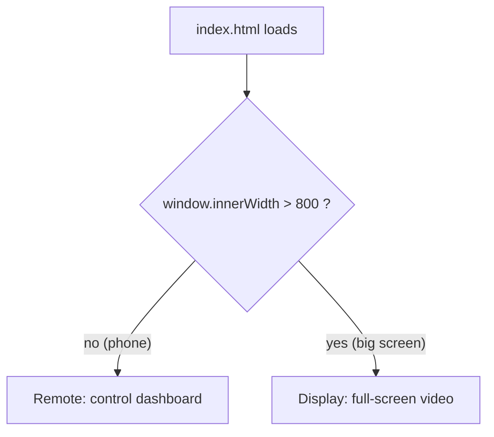

# `src/` - The Player App

This folder is the heart of the project: the page that plays Blackfacts videos and the page
that controls them. It is plain HTML/CSS/JavaScript with **no build step**. The scripts are
loaded one after another in `index.html`, and they share a single global object named `my`
that holds the app's state.

If you haven't yet, read the [root README](../README.md) first for the big picture. This file
is a closer, file-by-file tour.

> The QR-code landing page and the cloud-sync details live in
> [`qrcode/README.md`](qrcode/README.md). Note that two of the scripts loaded here
> (`black_my_setup.js` and `black_setup_dbase.js`) actually live in the `qrcode/` folder and
> are documented there.

---

## One page, two modes

There is a single player page, [`index.html`](index.html). When it loads, it figures out
whether it is the big **display** or a phone **remote** by checking the screen width:

- `my.showQRCode()` returns `true` when `window.innerWidth > 800`.
- `my.isRemote = !my.showQRCode()` (set in [`my_setup.js`](my_setup.js)).

So a **wide** screen is the display, and a **narrow** screen (a phone) is the remote.
[`init_ui.js`](init_ui.js) then builds the matching UI:

- Remote -> `create_remote_view()`: hides the video message pane and builds the grid of 365
  day buttons (the dashboard you control from your phone).
- Display -> `create_controlled_view()`: hides the dashboard and just shows the full-screen video.



---

## Startup order

`index.html` loads the scripts in this order, then `index.js` kicks everything off on
`DOMContentLoaded`:

1. `dateFacts.js` - defines the `dateFacts` catalog.
2. `player.js` - loads the YouTube IFrame API and defines the player.
3. `itp-molib` (from a CDN) - the cloud/database helper library.
4. `qrcode/black_my_setup.js` - app + Firebase config.
5. `qrcode/black_setup_dbase.js` - connects to the database and starts observing.
6. `my_setup.js` - local app settings.
7. `action.js` - attaches button/input event handlers.
8. `frame.js` - the per-frame animation loop.
9. `init_ui.js` - builds the UI.
10. `index.js` - `document_loaded()` ties it together.

`document_loaded()` (in [`index.js`](index.js)) calls `my_setup()`, `init_ui()`,
`black_setup_dbase()`, starts the animation/ping loops, and calls `setup_animationFrame()`.

---

## File-by-file

### `index.html`
The markup for both modes. Key elements (referenced by `id` throughout the JS):

- `id_dashboard` - the control panel shown on the remote.
- `id_button_previous`, `id_button_next`, `id_button_youtube` - playback controls.
- `id_date` - a date picker to jump to a specific day's fact.
- `id_button_toggle_buttons` / `id_index_button_container` - show/hide the grid of 365 day buttons.
- `id_player` - the `<div>` the YouTube player is injected into.
- `id_message_pane` / `id_message_text` - the on-screen caption/status text.

It also loads the scripts in the order described above. The `?v=63` on each script is a
cache-buster (see glossary in the root README).

### `index.js`
App startup and the bridge between the database and the player.

- `document_loaded()` - startup sequence.
- `update_blackfacts_index_dbase(index)` - **what the remote calls** to request a video: writes
  `blackfacts_index` into the shared database `item`.
- `update_blackfacts_index(newValue)` - **what the display reacts with** when the database
  changes: updates the caption and calls `video_play_index()` to actually play.
- `update_blackfacts_num_ui()` - builds the caption text (`#<n> <MMDD> <description>`) and syncs
  the date picker, trimming the boilerplate "Narrated by BlackFacts.com" text.
- `pingAction()` - periodically reports this device's status (portrait/group) to the database.

### `player.js`
A wrapper around the [YouTube IFrame Player API](https://developers.google.com/youtube/iframe_api_reference).

- Reads URL parameters via the `params` proxy: `playlist`, `delay`, `volume` (and elsewhere
  `group`, `title`).
- `setupVideo()` - creates the `YT.Player` and wires up its events (`onReady`, `onStateChange`,
  `onError`).
- `video_play_index(index)` - looks up the `videoKey` for a catalog index and cues that video.
- `getDateVideoKey(date)` - maps a calendar date to that day's video (`MMDD` -> `videoKey`),
  used for the "today" playlist.
- `execCommand()` / `execPlaylist()` - advance through a URL-provided `playlist`.
- Error handling maps YouTube error codes to readable messages.

> Note: if the URL has a `playlist` parameter, the page ignores cloud/remote control and just
> plays that playlist. This is how a standalone kiosk loop can be set up.

### `init_ui.js`
Builds the correct UI for the mode (see "One page, two modes" above). `create_index_buttons()`
generates one button per catalog entry (labelled `#001 0101`, etc.); tapping a button calls
`update_blackfacts_index_dbase(index)`. `toggle_365_panes()` shows/hides that button grid.

### `action.js`
All the event handlers for the remote's controls:

- `next_action()` / `previous_action()` - step the index forward/backward (wrapping around 365)
  and write it to the database.
- `date_input_action()` - convert the date picker value (`YYYY-MM-DD`) to an `MMDD` key and select
  that day's video.
- `youtube_action()` - open the current video on youtube.com in a new tab.
- `toggle_buttons_action()` / `toggle_365_panes()` - show/hide the 365-button grid.
- `qrcode_click_action()` / `toggleFullScreen()` - toggle full screen on the display.
- `allow_cloud_actions()` / `hold_cloud_actions()` - enable or pause reacting to cloud updates by
  clearing/setting `params`.
- `random_action()`, `first_action()`, `echo_delay_*` - extra helpers (some currently unused).

### `frame.js`
The per-frame loop (`requestAnimationFrame`). Each frame it:

- applies a pending index update (`my.index_update_pending`) coming from the database,
- nudges cued videos into actually playing (a workaround for autoplay quirks),
- records the player's startup time and detects/recovers from a startup **stall** by reloading,
- steps the optional clip-advance (`animLoop`) and status-ping (`pingLoop`) loops,
- updates the on-screen status message.

### `my_setup.js`
Local, per-device settings applied at startup: timing values (`animTime`, `pingTime`), the
initial `blackfacts_index` (`-1`), the `my.isRemote` decision, and the full-screen click action.
It calls `black_my_setup()` (in `qrcode/`) for the app + Firebase config.

### `dateFacts.js`
The catalog: a big object named `dateFacts`, keyed by `MMDD` (e.g. `'0101'`). Each entry:

```js
'0101': {
  videoKey: 'VZTSYcFTNSA',                 // YouTube video ID
  title: 'BlackFacts Minute: January 1',
  description: 'Fact-Of-The-Day for: January 01 ...',
  thumbnail: 'https://i.ytimg.com/vi/VZTSYcFTNSA/maxresdefault.jpg',
  index: 0,                                // position in the sorted list (0-364)
}
```

`player.js` sorts the keys into `dateFactsKeys` and uses `index` to move between videos.
This file is the single source of truth for "what videos exist." Adding new video *series*
(see [`ROADMAP.md`](../ROADMAP.md)) will mean rethinking or extending this structure.

### `style.css`
Styling for the player page. It is deliberately minimal right now: black background, white
monospace text, big buttons on small screens (`font-size: 5vw` under 600px wide). This is the
"utilitarian" look the [roadmap](../ROADMAP.md) proposes to refresh.

---

## URL parameters cheat sheet

| Parameter   | Used by        | Effect |
|-------------|----------------|--------|
| `group`     | both           | Shared cloud channel (`s0`, `s1`, ...). Ties a remote to a display. |
| `playlist`  | player.js      | Play a fixed list of video keys (or `today`); disables cloud control. |
| `delay`     | player.js      | Milliseconds to wait before starting the playlist. |
| `volume`    | player.js      | Initial volume (currently not actively applied). |
| `title`     | player.js/index.js | Force a fixed caption instead of the auto-generated one. |
| `v`         | all            | Cache-buster version tag (e.g. `?v=63`). |
