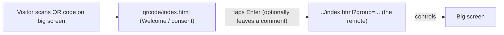

# `src/qrcode/` - Landing Page & Cloud Sync

This folder does two jobs:

1. It is the **QR-code landing page** (`index.html`) - the first thing a visitor sees after
   scanning the code on the big screen.
2. It holds the **shared configuration and cloud-database code** used by *both* the landing page
   and the main player (`black_my_setup.js` and `black_setup_dbase.js`).

Read the [root README](../../README.md) for the big picture and [`src/README.md`](../README.md)
for the player app.

---

## The visitor flow



1. The big screen shows a QR code that points at `qrcode/index.html` (often with a `?group=...`).
2. The visitor lands on the **Welcome to Blackfacts** page, which states that anonymous usage
   data is stored and invites them to leave a short comment.
3. Tapping **Enter** navigates to `../index.html`, carrying the same query string (so the `group`
   is preserved). Because they're on a phone, the player opens in **remote** mode.

---

## File-by-file

### `index.html`
The landing page markup:

- `id_title` - "Welcome to Blackfacts" heading.
- `id_button_enter` / `id_link` - the "Enter mo-blackfacts" action that sends the visitor into
  the player. An inline script copies the current query string onto this link so the `group`
  carries through.
- `id_name`, `id_comment`, `id_button_add`, `id_button_remove`, `id_comments_ol` - the optional
  comment box and the running list of comments.

### `index.js`
Startup and the comments UI for the landing page.

- `document_loaded()` - calls `black_my_setup()` and `black_setup_dbase()`, starts the frame loop,
  and stamps the current group into the footer.
- `enter_click_action()` - submits any comment, then navigates to the player link.
- `add_click_action()` / `remove_click_action()` - add or remove the visitor's comment.
- `show_comments()` - renders the comment list (newest first).

### `frame.js`
A small `requestAnimationFrame` loop. Its main job here is to re-render the comment list when
`my.comment_update_pending` is set by a database change.

### `black_my_setup.js`  (shared config)
The single place that configures the app and its cloud backend. Important values:

```js
my.appTitle    = 'Blackfacts';
my.fireb_config = 'jhtitp';        // which Firebase project config moLib uses
my.dbase_rootPath = 'm0-@r-@w-';   // database path template
my.mo_app  = 'mo-blackfacts';
my.mo_room = 'm1-blackfacts';
my.mo_group = 's0';                // default group; overridden by ?group=...
```

- It reads the `group` URL parameter and, when it is `s0`, switches the room to `m0-blackfacts`.
- `my.showQRCode()` returns `window.innerWidth > 800` - this is the same check that decides
  **display vs. remote** in the player.
- It also sets some layout sizes (`footerHeight`, `qrCodeWidth`) based on orientation.

> The `fireb_config`, `dbase_rootPath`, `mo_app`, and `mo_room`/`mo_group` together tell the
> moLib library *which* cloud database and *which* record this app reads and writes.

### `black_setup_dbase.js`  (shared cloud sync)
Connects to the database and sets up the observers that make the live sync work.

- `black_setup_dbase()` - awaits `dbase_app_init(my)`, then starts the observers.
- `observe_meta()` - watches the shared `item` record. When `blackfacts_index` changes, it stores
  the new value and sets `my.index_update_pending = 1` so the player's frame loop picks it up and
  plays the video. (This is the *read* side; the player's `update_blackfacts_index_dbase()` is the
  *write* side.)
- `observe_comment_store()` - watches the `comment_store` collection and keeps `my.comment_store`
  in sync (add/change/remove).
- `new_entry()` / `add_action()` / `remove_action()` - create, store, and remove visitor comments,
  maintaining a `comment_count`.

---

## The group / room model

- **room** (`mo_room`) - a larger namespace for the app's data (`m0-blackfacts` or `m1-blackfacts`).
- **group** (`mo_group`, e.g. `s0`, `s1`) - the shared channel within the room. Every device using
  the same group reads and writes the same `blackfacts_index`, so they stay in sync.
- The group is chosen with the `?group=...` URL parameter and defaults to `s0`.

Practically: give one big screen its own group, generate a QR code that includes that group, and
every phone that scans it controls *that* screen.

---

## The `itp-molib` dependency

The cloud sync, the database helpers (all the `dbase_*` functions), and the `Anim` loop come from
the [`itp-molib`](https://www.npmjs.com/package/itp-molib) library, loaded from a CDN in the HTML:

```html
<script src="https://unpkg.com/itp-molib@0.2.4/dist/moLib.umd.js?v=63"></script>
```

> Heads up: the player page (`src/index.html`) currently loads moLib **0.2.4**, while this
> landing page (`qrcode/index.html`) loads **0.2.3**. Keep that in mind if you hit a sync quirk;
> aligning the versions is a reasonable small cleanup task.

moLib is the client side of **moSalon**. The functions you'll see used here:

- `dbase_app_init`, `dbase_app_observe`, `dbase_update_item`, `dbase_add_key`, `dbase_remove_key`,
  `dbase_increment` - read/write the shared database.
- `Anim` - the simple animation/timer loop used by the player.
